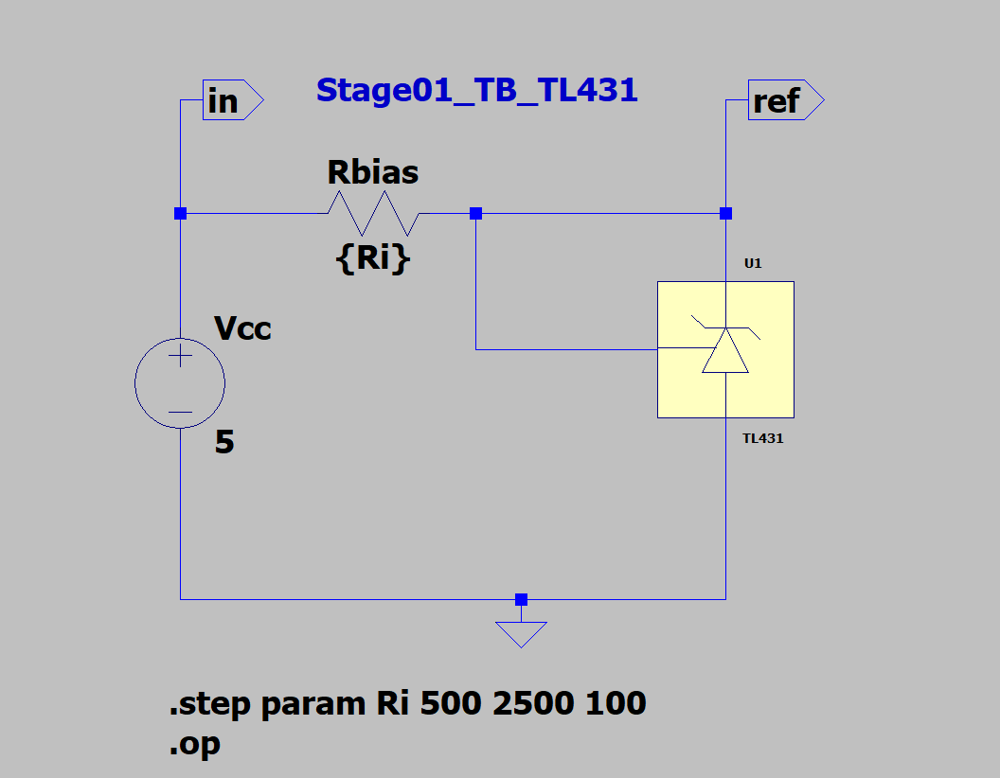
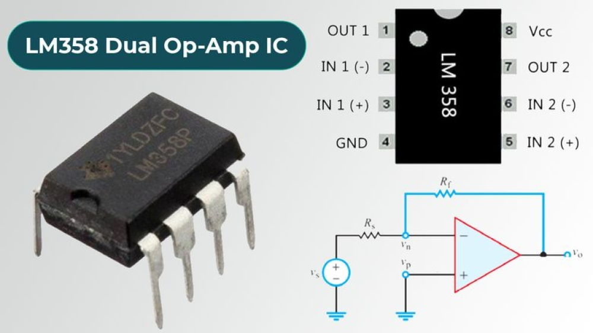

# 01_LDO_Regulator_Guide

## 1. Overview & Introduction
An LDO (Low Dropout Regulator) is a type of voltage regulator that can maintain a steady output voltage with a very small difference between the input and output voltages. The advantages of an LDO include the absence of switching noise, smaller size, and simplicity in design compared to switching regulators. The LDO is particularly useful in battery-powered devices where efficiency and low noise are critical. the disadvantages include heating issues that can arise when the input voltage is significantly higher than the output voltage, leading to power loss.

In this guide, we will cover the design, simulation, and testing of a discrete LDO regulator circuit using common components. The guide will include design targets, SPICE simulation setup, part lists, build steps, measurement techniques, and troubleshooting tips.

## 2. Design Targets
| Parameter        | Goal / Spec              | Rationale or Constraint                        |
|------------------|--------------------------|------------------------------------------------|
| Output Voltage   | 3.3 V ± 5%               | Common voltage for digital circuits            |
| Output Current   | 0 → 250 mA max           | Typical load for microcontrollers              |
| Dropout Voltage  | ≤ 0.35 V @ 250 mA        | Limited by PNP V<sub>CE(sat)</sub> of TIP42C   |
| Load Regulation  | ≤ 0.1% (0–250 mA)        | Ensures stable output under varying loads      |
| Line Regulation  | ≤ 0.5% (4.0–6.0 V)       | Maintains output voltage with input changes    |
| PSRR             | ≥ 50 dB (100 Hz–10 kHz)  | Minimizes output noise from the power supply   |
| Thermal Rise     | ≤ 30 °C @ 250 mA         | Keeps junction temperature within limits       |

- **Output Voltage**: The regulated voltage provided to the load; must be stable and accurate for digital circuits.
- **Output Current**: Maximum current the regulator can supply; determines sizing of components and thermal limits.
- **Dropout Voltage**: Minimum difference between input and output voltage for proper regulation; lower values allow operation with less headroom.
- **Load Regulation**: Measures how much output voltage changes as load current varies; tighter regulation means better performance under changing loads.
- **Line Regulation**: Indicates how well the output voltage is maintained as input voltage fluctuates; important for noisy or unstable supplies.
- **PSRR (Power Supply Rejection Ratio)**: Ability to suppress input voltage ripple/noise from appearing at the output; higher values mean cleaner output.
- **Thermal Rise**: Maximum temperature increase of the regulator under full load; ensures safe operation and longevity of components.


## 3. Part List
| Qty | RefDes | Part Number | Description / Value           | Key Rating                                     | Role                               | Datasheet           |
| --- | ------ | ----------- | ----------------------------- | ---------------------------------------------- | ---------------------------------- | ------------------- |
| 1   | Q1     | **TIP42C**  | PNP power transistor (TO‑220) | 65 W, β≈15, V<sub>CE(sat)</sub> ≈ 0.25 V @ 2 A | Series pass element                | see Component\_List |
| 1   | U1     | **LM358**   | Dual op‑amp                   | 3 → 32 V supply, rail‑to‑ground output         | Error amplifier                    | see Component\_List |
| 1   | U2     | **TL431**   | Programmable shunt ref        | V<sub>REF</sub> = 2.495 V                      | Precision reference                | see Component\_List |
| 2   | R1,R2  | —           | 10 kΩ / 30.1 kΩ (1 %)         | Sets VOUT = 3.3 V (VOUT = VREF·(1 + R1/R2))    | Feedback divider                   | —                   |
| 1   | R3     | —           | 220 Ω                         | Limits TL431 cathode current                   | Bias resistor                      | —                   |
| 1   | R4     | —           | 1 kΩ                          | Base stopper, limits op‑amp drive              | Stability                          | —                   |
| 1   | C1     | —           | 10 µF / 25 V X7R              | VIN decoupling                                 | Input filter                       | —                   |
| 1   | C2     | —           | 10 µF / 10 V X7R              | VOUT decoupling                                | LDO stability                      | —                   |
| 1   | C3     | —           | 100 nF NP0                    | TL431 bypass                                   | Reference noise                    | —                   |
| 1   | D1     | **1N4148**  | Small‑signal diode            | 75 V, 150 mA                                   | Reverse‑bias protection (optional) | —                   |
| 1   | R5\*   | —           | 0.22 Ω / 1 W, 1 %             | Sense resistor for optional current limit      | TBD                                | —                   |

> **Selection Notes:** derating, lifecycle, vendor lead-time, cost drivers.

## 4. SPICE Simulation Setup

### 4.1 Stage 1 — TL431 Precision Reference Characterization

The TL431 is a programmable shunt voltage reference that can be used to provide a stable reference voltage for the LDO regulator. In this stage, we will verify that the TL431 provides a stable output voltage of 2.495 V ±2% across its working cathode-current range and quantify its dynamic impedance. 

Reasons for choosing the TL431:
- It offers a precise reference voltage of 2.495 V with a tolerance of ±2%.
- It has a wide operating current range (1 mA to 100 mA), making it suitable for various applications.
- It features low output noise and excellent temperature stability.

- Pinout Diagram:<br>


#### 1. Objective

Confirm TL431 VREF ≈ 2.495 V ±2% across the LDO bias range and quantify dynamic impedance Zdyn.

**Test Overview:**

- We will perform a DC sweep of the cathode current (I_k) from 0.05 mA to 10 mA and measure the reference voltage (V_ref) at the reference pin. 
- We will calculate the dynamic impedance (Z_dyn) as the derivative of voltage with respect to current (dV/dI).


**Reasons for choosing this test:**

- Verifying the output voltage stability of the TL431 ensures the LDO regulator operates within its specified limits.
- Characterizing the dynamic impedance helps in understanding the transient response of the reference voltage under varying load conditions.

#### 2. LTspice Simulation Setup



- **Components to Place:**
  - **TL431**
  - **Current Source** (I_K) for input voltage
  - **Ground** (GND) for circuit reference

- **Connections**:
  - **TL431**:
    - Connect the Cathode to the Reference pin.
      - Label this node as `ref` using a net label.
    - Connect the Anode to ground.
    - 
  - **I_K**
    - Rename current source I1 to I_K for clarity.
    - Connect the positive terminal to the `ref` node of the TL431.
    - Connect the negative terminal to ground.
    - Change the value of I_K to {Ik} (a parameter defined in the simulation).
 
  - **Ground**:
    - Ensure V<sub>cc</sub> and the TL431 have a common ground reference.

> If the TL431 model is missing, add `TL431.sub` from TI or ON Semiconductor to the simulation directory.


- **Simulation Directive**:

```
; ---------- Parameters ----------
.param Vin=5 
.param Vref_nom=2.495
 
 ; ---------- Simulation Type ----------
.step param Ik list 0.05m 0.1m 0.2m 0.5m 1m 2m 5m 10m
 
 ; ---------- Analysis ----------
.op
  
 ; ---------- Measurements ----------
.meas op Vref FIND V(ref) 
.meas op I_K FIND I(I_K)
.meas op Zdyn FIND d(V(ref))/d(I(I_K))
```
- Where:
  - `V(ref)` is the voltage at the `ref` node of the TL431.
  - `I(I_K)` is the current through the TL431, swept from 0.05 mA to 10 mA.
  - `Zdyn` is the dynamic impedance calculated as the derivative of voltage with respect to current.

#### 3. Data to Plot

- V(ref) versus cathode current (I(I_K)) to verify voltage stability.
- Optionally, plot d(V(ref))/d(I(I_K)) to visualize dynamic impedance.
> **Note:** The dynamic impedance, when plotted in LTspice, will be shown as a negative `voltage`, disregard the negative and interpret as a positive resistance.

#### 4. Pass/Fail Criteria

| Parameter                  | Acceptable Range     | Target Value         | Simulation Result | Test Value | Percent Error | Test Result | Note          |
|----------------------------|----------------------|----------------------|-------------------|------------|---------------|-------------|---------------|
| Vref (I_k = 1.0 mA)        | 2.440 V – 2.550 V    | 2.495 V              | 2.4951 V          | 2.492 V    | 0.12 %        | Pass        | Excellent     |
| I_k (1.0 mA - 100.0 mA)    | 1 mA - 100 mA        | 1.0mA                | 400.78 µA         | 439 µA     | 9.68 %        | Pass        | Acceptable    |
| ΔV/ΔI (0.5 mA–10 mA)       | 0.2 Ω - 0.5 Ω        | ≤ 500 mΩ             | 336.84 mΩ         | N/A        | N/A           | N/A         | Not Tested    |

|
*Temperature coefficient to be evaluated in a separate bench test if supported by the model.

#### 5. Bench Measurement Procedure

1. Select a bias resistor for the desired Ik (e.g., 2.7 kΩ for ≈1 mA).
2. Set bench supply to 5 V, current-limit at 20 mA.
3. Measure Vref across TL431 ref-to-anode at 0.5 mA, 1 mA, and 10 mA by swapping resistors.
4. Optionally, apply heat to the TL431 and observe voltage drift.

#### 6. Documentation

- Record Ik, Vref, and calculated Zdyn in Excel or markdown.
- Note any readings outside specification.
- Include LTspice waveform screenshots in the lab notebook.

---

### 4.2 Stage 2 — Voltage Divider Validation

#### 1. Objective

Verify that the **10 kΩ / 30.1 kΩ** divider (both ±1 %) keeps the TL431 reference node (`VREF`) within **±2 %** of 2.495 V (→ VOUT ≈ 3.30 V) across resistor tolerances and spot-check temperature drift.

#### 2. LTspice Simulation Setup
Schematic Diagram:

- **Components to Place:**
  - **Voltage Source** (V1) for input voltage
  - **Resistors** (R1, R2) for the voltage divider
  - **Ground** (GND) for circuit reference
- **Connections**:
  - **Voltage Source**:
    - Connect V1 to the top of R1.
  - **Resistors**:
    - Connect the bottom of R1 to the top of R2.
    - Connect the bottom of R2 to ground.
    - Label the node between R1 and R2 as `VREF`.
    - Change resistor values to:
      -  R1 to `{R1nom*(1 + gauss(0.01) + 1u*RUN)}` ; R1 — nominal value with 1 % tolerance and Monte Carlo variation
      -  R2 to `{R2nom*(1 + gauss(0.01) + 1u*RUN)}` ; R2 — same
  - **Ground**:
    - Ensure all components share a common ground reference. 

- **Simulation Parameters**:
```
; ----- Parameters -----
; ---------- Parameters ----------
.param R1nom=10k  R2nom=30.1k     ; <-- TWO equal signs, plain ASCII
 
; ---------- Monte-Carlo loop ----------
.step param RUN 1 100 1
 
; ---------- Analysis ----------
.op
 
; ---------- Measurements ----------
.measure VSET FIND V(VREF)
.measure EPS  PARAM 100*(V(VREF)/2.495 - 1)
```

#### 3. Data to Plot 
| Task | Exact Click-Path in LTspice | Result |
|------|----------------------------|--------|
| **See the 100 values** | `View ► SPICE Error Log` → scroll; every step prints `RUN=n  VSET=…  EPS=…`. | Plain-text list you can copy. |
| **Save as text** | In the waveform window: `File ► Export ► Export Data as Text…` → choose node **VREF** and **RUN**. | Creates a tab-separated `.txt` you can open in Excel. |
| **Basic plot** | With VREF trace shown: vertical zoom to see the 100 stacked points. | Quick visual spread of midpoint voltage. |

*(LTspice has no built-in histogram or .meas CSV exporter—use the text export if you want to post-process in Excel/LibreOffice.)*

#### 4. Pass/Fail Criteria 
| Metric | Acceptable | Target |
|--------|------------|--------|
| **VREF (all 100 runs)** | 2.445 V ≤ VREF ≤ 2.545 V (±2 %) | Ideally within ±1 % |
| **EPS (%)** | –2 % ≤ EPS ≤ +2 % | –1 % ≤ EPS ≤ +1 % |
| **Yield** | ≥ 95 % of runs inside ±2 % | 100 % preferred |

#### 5. Bench Measurement Procedure
1. **Measure resistors** with a DMM; record actual R1 & R2.  
2. **Calculate expected VREF:**  
   \( V_\text{calc}=3.30\text{ V}\times \dfrac{R2}{R1+R2} \)  
3. **Breadboard divider**; power with 3.30 V, current-limit ≤ 10 mA.  
4. **Probe node `VREF`** and compare to \(V_\text{calc}\).  
5. *(Optional)* warm parts ~50 °C or cool with freeze spray; log ΔV per °C.

#### 6. Documentation Checklist  
- **Save files:** `Stage02_TB_Divider.asc`, `.raw`, and the exported `.txt` data file.  
- **Paste into lab notebook:** min, max, mean VREF; worst-case EPS.  
- **Photos:** breadboard setup + DMM reading.  
- **Summary line:** “100/100 Monte-Carlo runs within ±2 %; divider meets tolerance—Stage 2 PASS.”

---

### 4.3  Stage 3 — LM358 Error-Amplifier Validation  

- the LM358 is an operational amplifier that will be used to drive the PNP pass transistor in the LDO regulator circuit. It is important to ensure that the LM358 can provide sufficient output voltage and current to drive the pass transistor effectively.
<br>
- Pinout Diagram: 
 

#### 1. Objective
 Confirm the LM358 can swing its output high enough to fully drive the PNP pass transistor.
* **Respond** fast enough (slew-rate) to a 100 mV step.
* **Maintain** low DC error (input-offset) relative to divider tolerance.

#### 2. LTspice Simulation Setup

#### 3. Data to Plot

#### 4. Pass / Fail Criteria

#### 5. Bench Measurement Procedure

#### 6. Documentation Checklist

### 4.4  Stage 4 — PNP Pass Transistor Validation (TIP42C)

#### 1. Objective

#### 2. LTspice Simulation Setup

#### 3. Data to Plot

#### 4. Pass / Fail Criteria

#### 5. Bench Measurement Procedure

#### 6. Documentation Checklist

#### 1. Objective  
Confirm the LM358 can:  
* **Swing** its output high enough to fully drive the PNP pass transistor.  
* **Respond** fast enough (slew-rate) to a 100 mV step.  
* **Maintain** low DC error (input-offset) relative to divider tolerance.

#### 2. LTspice Simulation Setup
- **Components to Place**  
  - **Voltage Source (Vcc)** — 5 V DC supply  
  - **Pulse Source (Vin)** — PULSE(0 0.1 0 10u 10u 5m 10m) (0 → 100 mV, 0 initial, 10 µs rise/fall, 5 ms width, 10 ms period) 
  - **LM358 symbol** (single channel)  
  - **Resistor (RFB = 10 kΩ)** — output to inverting input *(unity-gain buffer)*  
  - **Ground** symbol  

- **Connections**  
  **Vin** → non-inverting input of LM358 (pin 3).  
  **Inverting input (pin 2)** → **output (pin 1)** via **RFB**.  
  **Op-amp Vcc** (pin 8) → 5 V; **Vee** (pin 4) → GND.  
  **Scope probes**:  
    * **V(IN+)** at non-inverting pin.  
     * **V(OUT)** at pin 1.

- **Simulation Directives**  
```
; 50 ms transient, start from 0
.tran 0 50m 0

; Measurements
.measure TRAN VHIGH  FIND   V(OUT)  WHEN  V(IN+)=0.10  RISE=1
.measure TRAN SR     PARAM  (dV(OUT)/dt)  FROM=1.1m  TO=1.2m
.measure TRAN VOS    FIND   (V(OUT)-V(IN+)) AT=25m
```

*Notes*

* Slew-rate measurement window (1.1 – 1.2 ms) sits on the rising edge; adjust if pulse edges differ.
* `.measure TRAN SR …` prints V/µs; convert to V/µs manually if needed.


#### 3. Data to Observe

| Trace               | What to Verify                                                  |
| ------------------- | --------------------------------------------------------------- |
| **V(OUT)** waveform | Reaches ≥ 3.8 V (swing) and follows VIN pulse with minimal lag. |
| **Cursor ΔV/Δt**    | Calculate slew rate; should exceed 0.3 V/µs.                    |
| **VOS measurement** | Steady-state output minus input ≤ 5 mV.                         |


#### 4. Pass / Fail Criteria

| Check              | Pass Threshold                    |                |        |
| ------------------ | --------------------------------- | -------------- | ------ |
| Output swing       | V<sub>OH</sub> ≥ 3.8 V @ 5 V rail |                |        |
| Slew rate          | ≥ 0.3 V / µs                      |                |        |
| Input offset (sim) |                                   | V<sub>OS</sub> | ≤ 5 mV |

*(Datasheet typicals: V<sub>OH</sub> ≈ 4 V, SR ≈ 0.5 V/µs, V<sub>OS</sub> ≈ 2 mV.)*


#### 5. Bench Measurement Procedure

1. **Breadboard** LM358 as unity-gain buffer (10 k feedback).
2. **Pulse VIN** with function-gen: 0 → 100 mV, 1 kHz; scope on VIN and VOUT.
3. **Measure** V<sub>OH</sub> (DC), slew-rate (ΔV/Δt), and offset via scope cursors.
4. **Log** any deviations > datasheet typicals; note supply current.


#### 6. Documentation Checklist

* **Save**: `Stage03_TB_LM358.asc`, `.raw`, and screenshot of VOUT vs VIN.
* **Spreadsheet**: swing (V), slew (V/µs), offset (mV) — sim vs bench.
* **Photo**: breadboard + scope capture.
* **Summary**: “LM358 meets swing (4.02 V), SR (0.48 V/µs), VOS (+2.1 mV) — Stage 3 PASS.”

---


## 5. Build Steps
1. **Schematic capture** – finalize symbols, net names, ERC pass.  
2. **PCB / breadboard layout** – placement priorities, grounding, routing rules.  
3. **Assembly** – solder order, inspection checkpoints.  
4. **Initial power-up** – current-limit, bring-up script, smoke test.

## 6. Measurements to Take
| Measurement              | Instrument                | Procedure Outline                       | Spec Limit / Target |
|--------------------------|---------------------------|-----------------------------------------|---------------------|
|                          |                           |                                         |                     |

## 7. How to Take Them
- **Equipment setup:** probe attenuation, bandwidth limits, calibration.  
- **Data capture & logging:** bench software, CSV script, STM32 data-logger.  
- **Safety / ESD:** isolation, discharge paths, PPE if high voltage.

## 8. Data & Plot Templates
Describe or link to blank `.csv` / `.xlsx` files with column headers such as:

``Time, V_IN, I_IN, V_OUT, I_OUT, Temp_C, …``

Suggested plots:
- **Metric vs. load:** e.g. efficiency (%) vs I_LOAD  
- **Transient waveform:** V_OUT after load step  
- **Bode plot:** gain & phase vs frequency  

## 9. Troubleshooting & Tips
Common failure modes, quick diagnostic checks, alternative components, layout “gotchas.”

## 10. Notes / Lessons Learned
Record deviations from SPICE, unexpected behaviours, improvement ideas for the next revision.

## 11. References
Textbooks, application notes, standards, and all critical datasheets.

## 12. Version History
| Date       | Author          | Revision | Major Changes |
|------------|-----------------|----------|---------------|
| 2025-07-26 | Eric Barrientos | v0.1     | Initial draft |
